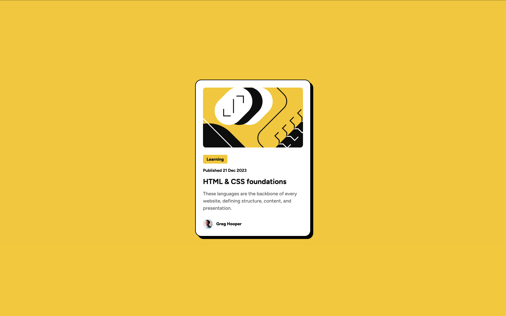

# Frontend Mentor - Blog preview card solution

This is a solution to the [Blog Preview Card challenge][blog-preview-card] on Frontend Mentor. Frontend Mentor challenges help you improve your coding skills by building realistic projects.

## Table of contents

- [Frontend Mentor - Blog preview card solution](#frontend-mentor---blog-preview-card-solution)
  - [Table of contents](#table-of-contents)
  - [Overview](#overview)
    - [The Challenge](#the-challenge)
    - [Screenshot](#screenshot)
    - [Links](#links)
  - [My process](#my-process)
    - [Built with](#built-with)
    - [What I learned](#what-i-learned)
    - [Useful resources](#useful-resources)
  - [Author](#author)

## Overview

### The Challenge

Users should be able to:

- See hover and focus states for all interactive elements on the page.

### Screenshot



### Links

- Solution URL: [Github/Blog-preview-card](https://github.com/Genrex7/blog-preview-card)
- Live Site URL: [Frontend Mentor/Blog-preview-card](https://genrex7.github.io/blog-preview-card/)

## My process

### Built with

- ![HTML][HTML]
- ![CSS][CSS]
- ![Google fonts][google-fonts]
- ![Flexbox][flexbox]
- ![Desktop-first workflow][desktop-first-workflow]

### What I learned

I learned the importance of using semantic HTML elements like `<main>` to organize content logically. This not only improve accessibility and SEO but also make the code more readable and maintainable. The `<head>` section includes important metadata, a favicon, and links to external stylesheets — all crucial for a complete web document.

I imported the Figtree font from Google Fonts to establish a cohesive and modern typeface across the project. I also learned to use `rem` units for font sizes, which makes the text more responsive and scalable across devices.

Importing fonts from Google Fonts was easy and made my text look unique and cool.

```html
<link rel="preconnect" href="https://fonts.googleapis.com" />
<link rel="preconnect" href="https://fonts.gstatic.com" crossorigin />
<link
	href="https://fonts.googleapis.com/css2?family=Figtree:ital,wght@0,300..900;1,300..900&display=swap"
	rel="stylesheet"
/>
```

To make the card feel interactive, I added hover effects using:

```css
transform: translateY(-8px);
box-shadow: 16px 16px 0 rgba(0, 0, 0, 0.9);
transition: all 0.3s ease;
```

In queries.css, I applied media queries to make the design responsive. I learned how to resize text and padding for smaller screens.

```css
@media (max-width: 375px) {
}
```

Following a desktop-first approach helped me ensure the UI is accessible and usable on almost all device sizes, from phones to desktops.

### Useful resources

- [MDN Web Docs - HTML Elements](https://developer.mozilla.org/en-US/docs/Web/HTML/Element) - This helped me understand the importance of using semantic HTML elements like `<main>`.
- [Google Fonts](https://fonts.google.com/) - A great resource for importing fonts easily and making text look unique.
- [CSS Tricks - Media Queries](https://css-tricks.com/snippets/css/media-queries-for-standard-devices/) - This helped me understand how to use media queries effectively to make my design responsive.

## Author

- Frontend Mentor - [@Genrex7](https://www.frontendmentor.io/profile/Genrex7)
- Twitter - [@DeepakKMeena07](https://x.com/DeepakKMeena07)

<!-- [![Frontend Mentor][fronendmentor]][blog-preview-card] -->

[blog-preview-card]: https://www.frontendmentor.io/challenges/blog-preview-card-ckPaj01IcS
[HTML]: https://img.shields.io/badge/HTML5-E34F26?style=for-the-badge&logo=html5&logoColor=white
[CSS]: https://img.shields.io/badge/CSS-239120?&style=for-the-badge&logo=css3&logoColor=white
[fronendmentor]: https://img.shields.io/badge/Frontend%20Mentor-3F54A3?style=for-the-badge&logo=frontendmentor&logoColor=white
[google-fonts]: https://img.shields.io/badge/Google%20Fonts-4285F4?style=for-the-badge&logo=googlefonts&logoColor=white
[flexbox]: https://img.shields.io/badge/Flexbox-000000?style=for-the-badge&logo=flexbox&logoColor=white
[desktop-first-workflow]: https://img.shields.io/badge/Desktop%20First%20Workflow-000000?style=for-the-badge&logo=desktop&logoColor=white
